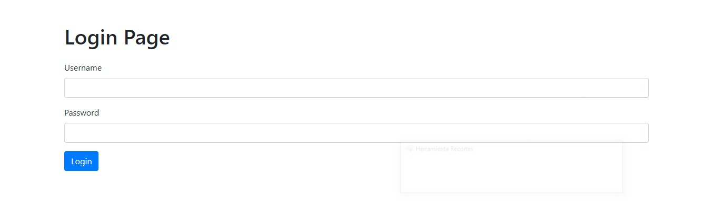
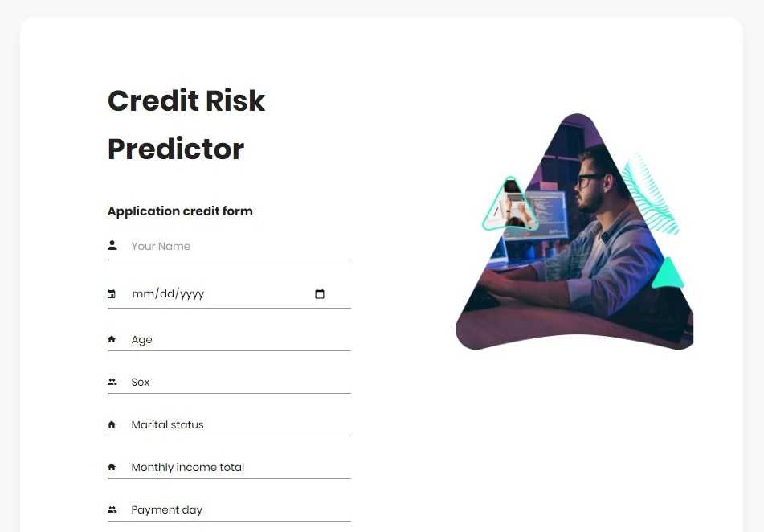
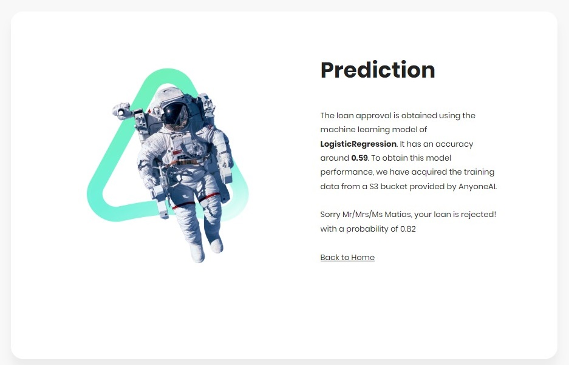
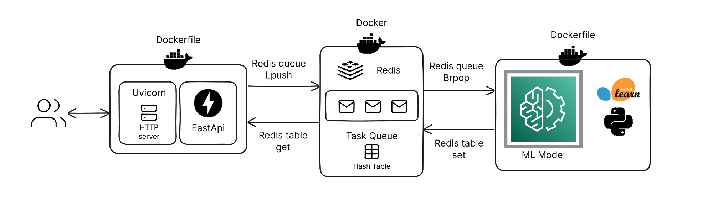

# CreditGuard: Machine Learning for Risk Assessment

# Preview

Badge [source](https://shields.io/)

## Authors

- [Pedro Del Bianco](https://github.com/pedroodb) (Tutor)
- [Oscar Amarilla](https://github.com/Oscar-Amarilla) (Collaborator)
- [Yessid Rios](https://github.com/YessidR) (Collaborator)
- [Fabian Moreno](https://github.com/FabianmorenoDS) (Collaborator)
- [Matias Gomez](https://github.com/tutecode) (Collaborator)
- [Christian Suca](https://github.com/christian6000) (Collaborator)

## Table of Contents

- [Executive Summary](#Executive-Summary)
- [Overview](#Overview)
- [Dataset Access and Structure](#Dataset-Access-and-Structure)
- [Run Notebooks locally](#Run-Notebooks-locally)
- [Run FastAPI App with Docker](#Run-FastAPI-App-with-Docker)

## Executive Summary

**Industries:** *fintech*, *banks*, *logistics*, *delivery apps*, *insurtech*, *many others*

**Technologies and Tools:** *Supervised Learning*, *Deep Learning*, *HTTP APIs (FastAPI)*, *Scikit-learn*, *Pandas*, *Numpy*, *TensorFlow*, *Docker*, *Redis*, *HTML*, *CSS*.

The fintech ecosystem has experienced rapid growth in recent years and established itself as a key actor to meet the demands and needs of financial consumers. Growth was fueled by increasing demand for financial services not provided by the traditional financial sector, and increased demand for digital financial services because of the COVID-19 pandemic. In the US, companies that have taken the lead in these industries are [Stripe](https://stripe.com/docs/radar/risk-evaluation), [Affirm](https://www.affirm.com/business/blog/alternative-underwriting), [Brex](https://www.brex.com/), [Marqeta](https://www.marqeta.com/platform/riskcontrol), among others. In the Latam region payments unit [Mercado Pago](https://www.mercadopago.com.ar/) from Mercado Libre, companies like [Nubank](https://nubank.com.br/en/), [Creditas](https://www.creditas.com/), [d-local](https://dlocal.com/), [Clip](https://clip.mx/), [Ualá](https://www.uala.com.ar/), [Clara](https://www.clara.com/), and most recent ones like [Pomelo](https://pomelo.la/en/) are growing fast and in constant need of data analysis and modeling for problems like credit risk analysis, fraud detection, customer's churn prediction or behavioral models to predict untimely payments.

Credit risk modeling is one of the most common uses of machine learning within this industry, whose goal is to use financial data to predict default risk. When a business or individual applies for a loan, the lender must evaluate whether the business can reliably repay the loan principal and interest. The machine learning model learns from data (such as firm information, financial statements, previous transactions, previous credit history, etc) and can accurately predict repayment probability for a given business loan applicant.

This type of solution has very wide applicability across not only fintech but also many business sectors and industries like logistics, banks, delivery apps, freight cargo companies, insurtech, etc.) and could be easily adapted to any other "risk estimation" business challenges.

## Overview

In a nutshell, this project will result in an API service that is backed by a machine learning model (or many models) that will accept a financial profile and will be able to predict a credit risk score for that profile. The individual components for this project are very similar to what you have implemented in the last three Projects. You can reuse as much code as you want to leave yourself more time for working on the core dataset and model training.

## Deliverables

**Goal:** The main objective of this project is to build a service capable of predicting the credit scores of people based on financial transactional information. To properly test how this model would behave in a real environment we will also ask you to propose and run a simulation of your model, showing each profile in the test dataset and asking if it would assign a credit or not to that person, at then evaluate if a bank or fintech using that model will end up making more money or losing it.

In order to graduate from the ML Developer Career, you have to approve the Main Deliverables. You are also welcome to complete the Optional Deliverables if you want to continue to add experience and build your portfolio, although those are not mandatory. 

**Main Deliverables:**

1. Exploratory Dataset Analysis (EDA) Jupyter notebooks and dataset
2. Scripts used for data pre-processing and data preparation
3. Training scripts and trained models. Description of how to reproduce results
4. The model trained for a credit score prediction
5. A simulation of your model making predictions on a testing dataset, documentation about the results and the simulation process
6. API with a basic UI interface for demo (upload user's transactional data and return a score prediction)
7. Everything must be Dockerized and ready to be deployed

**Additional Optional Deliverables:**

1. Service should be properly secured with token-based authentication
2. Ability to retrain the model "online" with new data added by users

## Dataset Access and Structure

The dataset to build this model(s) can be found in S3. To access the dataset you will have to use the boto3 library and here are the key and secret key that you can use for read-only access.

- **Dataset:** ...
- **Key:** ...
- **Secret:** ...

**Note:**

- The dataset has 54 variables on each field and 50.000 rows of training data. 
- The dataset can be downloaded to your system and experimented on your local development system given its size.
- Confidentiality notice. Please don't upload it to any other services or public drives as this is a private dataset.

### Guide to Download dataset

1. To access the dataset you will have to use the **Boto3** library and here are the key and secret key that you can use for read-only access.
2. Install **AWS-CLI**, using this [guide](https://docs.aws.amazon.com/es_es/cli/v1/userguide/cli-chap-install.html).
3. Then configure AWS with "key" and "secret" using the command aws configure
4. You'll be prompted to enter your access key, secret access key, default region, and output format. in region and output only with None
5. Finally use copy command from aws to local directory `aws s3 cp <s3_url> <local_destination>`

**For example using this code:**

`bash
aws s3 cp --recursive s3://mys3url/ ./local-folder/
`

* You will have this structure in your folder:
  - LeaderBoard_Data.zip
  - Leaderboard_Submission_Example.zip
  - PAKDD2010_Leaderboard_Submission_Example.txt
  - PAKDD2010_Modeling_Data.txt
  - PAKDD2010_Prediction_Data.txt
  - 'PAKDD-2010 training data.zip'
  - PAKDD2010_VariablesList.XLS
  - Prediction_Data.zip

**References:**

You can analyze the state of the art and make your own research on the subject. Below you will find couple of good references:

- [A comparative study on machine learning models combining with outlier detection and balanced sampling methods for credit scoring - Hongyi Qian, Shen Zhang, Baohui Wang, Lei Peng, Songfeng Gao, You Song](https://arxiv.org/abs/2112.13196)
- [Sequential Deep Learning for Credit Risk Monitoring with Tabular Financial Data - Jillian M. Clements, Di Xu, Nooshin Yousefi, Dmitry Efimov](https://arxiv.org/abs/2012.15330)

## Run Notebooks locally

- First you have to run the `src/notebooks` folder:
    - Import dataset / Exploratory Data Analysis: `eda.ipynb` 
    - Encoding and Model: `model.ipynb`

> In the **helper_functions** folder you can find all the functions from the notebooks

### Install a VirtualEnv

**Terminal PowerShell/WSL:**

- If first time: 
    - on **Linux** > `pip3 install virtualenv`
    - on **Windows** > `pip install virtualenv`
- Make `VirtualEnv`:
    - on **Linux/Mac** > `python3 -m virtualenv env`
    - on **Windows** > `python -m virtualenv env`
- Activate `.env` Virtual Environment
    - on **Linux/Mac** > `source env/bin/activate`
    - on **Windows** > `./env/Scripts/activate`
- Install libraries from **requirements.txt** >
    - on **Linux/Mac** >`pip3 install -r ./requirements.txt`
    - on **Windows** > `pip install -r ./requirements.txt`

## Run FastAPI App with Docker

- First open `Docker`

**Terminal PowerShell:**

0. Change directory to `/credit-risk-analysis` project > `cd credit-risk-analysis`
1. Build services from `docker-compose.yml` > `docker-compose build`
2. Up services from `docker-compose.yml` > `docker-compose up`

**Endpoints:**

1. Run `Home` page > `http://localhost:8000`
2. Run `index` page > `http://localhost:8000/index`
3. Run `prediction` page > `http://localhost:8000/prediction`

### Arquitecture

### Testing results

Inside `src/notebooks` folder are 2 additional files.

1. `app_test_prediction.csv` is the prediction for the data without the target column.
2. `testing.ipynb` is the notebook which indicates how to load and run the model to obtain the prediction for a dataset.
